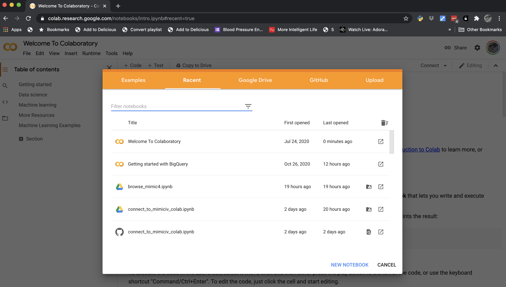
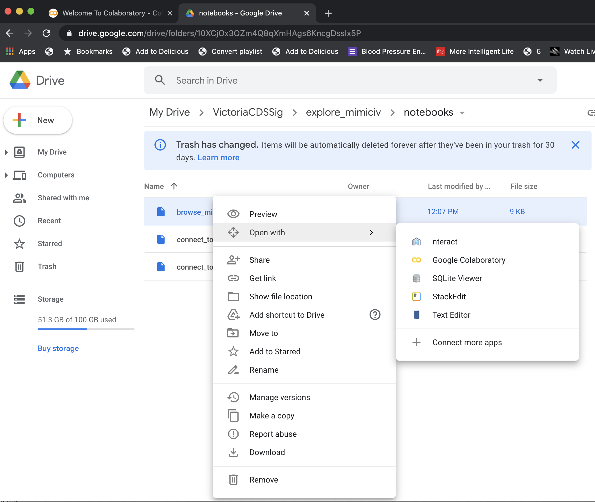

# explore_mimiciv

## Accessing MIMIC-IV via Colaboratory

This repository contains some Jupyter notebooks for exploring MIMIC-IV using Google's BigQuery. This assumes you have already been granted access to MIMIC via Physionet, that you have a Google account, and you have enabled Google Colaboratory with Google Drive.

Two approaches:

- Go straight to https://colab.research.google.com/. You should be greeted by a web page looking something like this:



This allows you to import the notebook directly from GitHub, Google Drive, or your computer.

- Clone the repository to your Google Drive on your computer and the go to https://drive.google.com/. Navigate to the directory where you have cloned the repository and you should be able to see the the notebooks. If you have enabled Colaboratory with Google Drive, you should be able to right click on the notebook and open it in Colaboratory.



## Caveats

These are unpolished notebooks. Probalby the best starting point for the novice is `browse_mimic4.ipynb`. This defines a class that allows you to select which database you want to explore and then which table within the database. The visualizations are done via Seaborn, which isn't great for large number of numeric values. I'm using Ibis to query BigQuery, which defaults to limit the number of returned rows to no more than 10k. I've left this in place for now.

`connect_to_mimiciv_colab.ipynb` is similar except it assumes you've already created a Pandas DataFrame by querying a specific table in a database.

`connect_to_mimiciv_bq.ipynb` does not use Colaboratory but instead runs from your computer and assumes you have already created and downloaded a secret from Google.

I'll post a video of how to use them later. Improvements and feedback are welcome.

## Accessing BigQuery from your home computer.

Colaboratory is great for quick explorations and especially if you want to explore using GPUs or TPUs. However, as a free service there are limitations.

For more flexibility, you can access BigQuery from your own computer. Here are my notes for getting an environment setup using Anaconda Python.

### Authenticating

For me, the trickiest step was getting authentication set up. It turns out, thankfully, to be straightforward, once you find the correct documentation.

The key document for me was [this web page](https://googleapis.dev/python/google-api-core/latest/auth.html). And the key line on the key page is this:

```
If you’re developing locally, the easiest way to authenticate is using the Google Cloud SDK.

```

#### Install the [Google Cloud SDK](https://cloud.google.com/sdk)

#### Set Your Default Project

I have multiple Google Cloud projects. before authenticating, I need to have the project I want to use with BigQuery set. [This](https://stackoverflow.com/questions/46770900/how-to-change-the-project-in-gcp-using-cli-commands) stackoverflow post showed me what to do.

- Set your preferred Google Cloud project.
```bash
gcloud config set project mimic4-desktop
```
- Create authentication credentials
```bash
gcloud auth application-default login
```

This creates credentials and stores them in a default location that Google applications should be able to find automatically, although you can always provide the location explicitly.

### Creating an Environment

I've created a YAML file for creating an environment with Anaconda: (`environment.yml`).

The environment is created by running the following command in the directory containing the `environment.yml` file:

```bash
conda env create --file environment.yml
```

This environment can then be activated as follows:

```bash
conda activate mimic_google
```

### Testing

I've created a couple of scripts to test if the environment is set up correctly. The first script is `code/bc1.py` ("basic connect version1") which uses the Public Stackoverflow data set and relies on the Google Cloud library. It pulls the first 5 rows from the `posts_questions` table.

```bash
(mimic_google) bucksaw:code brian$ python bc1.py
Row((datetime.datetime(2020, 9, 2, 16, 26, 50, 757000, tzinfo=<UTC>), 0), {'creation_date': 0, 'answer_count': 1})
Row((datetime.datetime(2020, 8, 21, 19, 18, 7, 333000, tzinfo=<UTC>), 0), {'creation_date': 0, 'answer_count': 1})
Row((datetime.datetime(2020, 8, 26, 7, 26, 42, 693000, tzinfo=<UTC>), 0), {'creation_date': 0, 'answer_count': 1})
Row((datetime.datetime(2020, 8, 27, 9, 17, 36, 597000, tzinfo=<UTC>), 0), {'creation_date': 0, 'answer_count': 1})
Row((datetime.datetime(2020, 8, 29, 11, 37, 14, 963000, tzinfo=<UTC>), 0), {'creation_date': 0, 'answer_count': 1})
```

Another script (`mc1.py`) tests whether you can access the MIMIC-IV databases. It runs similarly: pulls the first 5 rows from the `patients` database.

#### Using [Ibis](https://ibis-project.org/)

Ibis is a project that aims to create a uniform interface to multiple big data platforms that eliminates the complexity of SQL.

Google provides a tutorial about accessing BigQuery with Ibis [here](https://cloud.google.com/community/tutorials/bigquery-ibis).

There is one tricky issue related to billing that is addressed in the Ibis documentation [here](https://ibis-project.org/docs/backends/bigquery.html#bigquery-quickstart). Namely, when using BigQuery you always have to be connected to a billable account (even if you will always be below the monthly limit). Ibis assumes that the data you want to query exists within the billable project; this will __not__ be the case with MIMIC-IV. The workaround is straightforward.

- Create a connection to a resource in your project (e.g. a "testing" or "development" database). You don't have to do anything other than provide the name of a resource (i.e., you do not need to create this resource).
- With that connection, create a database object pointing to the database outside of your billable project.

The `ic1.py` script demonstrates how to do this. A similar script is provided for testing access to MIMIC-IV (`mic1.py`).
